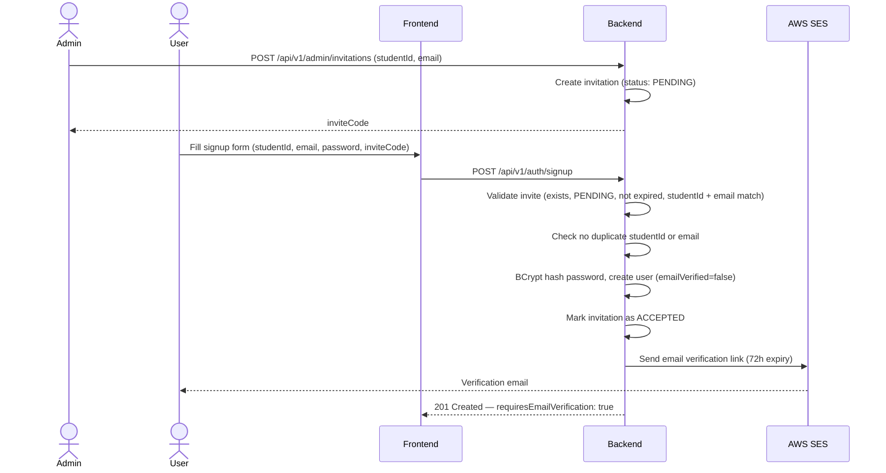
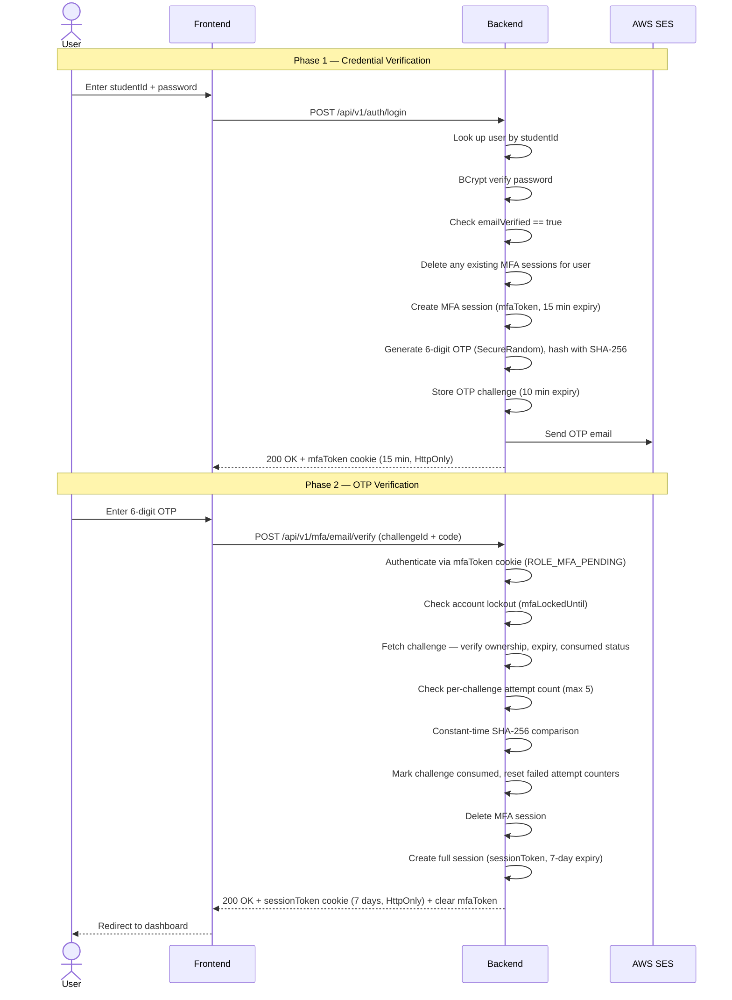
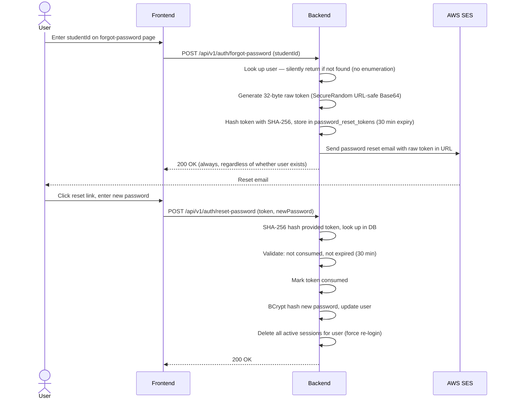

# Authentication & Authorization

## Overview

The 3D Western dashboard uses a **mandatory two-factor authentication** system. Every login requires both a password and an email OTP — there is no bypass or opt-out. Registration is invite-only, and all accounts must verify their email address before they can log in for the first time.

The backend enforces authentication via two stateless cookie-based token types: a short-lived `mfaToken` (15 min) that unlocks only the MFA endpoints during the OTP step, and a long-lived `sessionToken` (7 days) that grants full API access after OTP verification succeeds. Both are `HttpOnly; Secure` cookies, inaccessible to JavaScript.

---

## Registration (Invite-Only)

Accounts cannot be self-registered. An admin must first create an **invitation** that binds a specific `studentId` and `email` to an invite code. The invitation expires (configurable, default 30 days) and is single-use.

**Flow:**



**Validation rules:**

- `inviteCode` must exist, be `PENDING`, and not expired
- `studentId` and `email` in the request must exactly match the invitation record
- No existing user with the same `studentId` or `email`
- Password minimum: 10 characters

**Implementation:** `SessionService.signup()` — `dashboard-backend/src/main/kotlin/.../authentication/SessionService.kt`

---

## Email Verification

After signup, the account is created with `emailVerified = false`. The user cannot log in until verification is complete.

A `SHA-256`-hashed UUID token is stored in `email_verification_tokens`. The plaintext token is sent in the verification link. On verification, the token is consumed (single-use) and `users.emailVerified` is set to `true`.

**Token properties:**

- Expiry: 72 hours
- Single-use (consumed on first valid use)
- Hashed at rest (SHA-256, stored as Base64)
- Constant-time comparison on verification to prevent timing attacks

**Rate limiting on resend:** Max 3 resend requests per 5-minute window per user.

**Implementation:** `EmailVerificationService` — `dashboard-backend/src/main/kotlin/.../email_verification/EmailVerificationService.kt`

---

## Login Flow

Login is a two-phase process. Phase 1 validates credentials and initiates an MFA challenge. Phase 2 verifies the OTP and issues a full session.



**Security note on enumeration prevention:** The login endpoint returns the identical `INVALID_CREDENTIALS` error whether the `studentId` does not exist or the password is wrong. The error message is always `"Invalid credentials"` — no hint is given about which field failed.

---

## Token Types & Cookies

| Cookie         | Value                     | Expiry     | Role granted                  | Accessible to JS |
| -------------- | ------------------------- | ---------- | ----------------------------- | ---------------- |
| `mfaToken`     | UUID (MFA session token)  | 15 minutes | `ROLE_MFA_PENDING`            | No (HttpOnly)    |
| `sessionToken` | UUID (full session token) | 7 days     | `ROLE_Member` or `ROLE_Admin` | No (HttpOnly)    |

Both cookies are also accepted as `Authorization: Bearer <token>` headers for API clients that can't use cookies.

**Token priority:** `SessionAuthFilter` (`@Order(1)`) runs first and looks for a `sessionToken`. If not found, `MfaSessionAuthFilter` (`@Order(2)`) looks for a `mfaToken`. The MFA filter skips any request already authenticated by the session filter.

**Session refresh:** `POST /api/v1/auth/refresh` extends the active `sessionToken` by 7 days from now and resets the cookie max-age. Expired sessions cannot be refreshed.

---

## MFA — OTP Details

**OTP generation:**

- 6-digit numeric code
- Generated with `SecureRandom` (cryptographically secure)
- Formatted with leading zeros (e.g. `042317`)

**OTP storage:**

- Plaintext is never persisted
- Stored as `SHA-256` hash (Base64-encoded) in `email_otp_challenges.otp_hash`
- Challenge expires in **10 minutes**

**OTP verification:**

- `MessageDigest.isEqual()` for constant-time comparison (prevents timing attacks)
- Per-challenge attempt counter: locked after **5 failed attempts**
- Per-account failed attempt counter: account MFA locked for **15 minutes** after **10 total failed attempts** across all challenges

**OTP resend rate limit:** Max **3 resends per 5-minute window**. Each resend invalidates all existing active challenges for the user and creates a new one.

**Implementation:** `MfaService` — `dashboard-backend/src/main/kotlin/.../mfa/MfaService.kt`

---

## Password Reset

The password reset flow is entirely email-driven and does not require the user to be logged in.



**Token properties:**

- 32 bytes of `SecureRandom` data, URL-safe Base64 encoded (no padding)
- Hashed at rest (SHA-256)
- Expiry: 30 minutes (configurable via `password.reset.token-expiry-minutes`)
- Single-use — consumed immediately on successful reset
- On successful reset, all existing sessions for that user are invalidated

**Minimum password length:** 10 characters (enforced at reset and registration).

**Implementation:** `PasswordResetService` — `dashboard-backend/src/main/kotlin/.../authentication/PasswordResetService.kt`

---

## Session Management

Sessions are stored in the `sessions` table. Each row links a UUID `sessionToken` to a `users` row via `student_id`.

**Lifecycle:**

1. Created on successful OTP verification (`MfaService.verifyEmailOtp`)
2. Looked up on every authenticated request (`SessionAuthFilter`)
3. Deleted on logout (`SessionService.logout`)
4. Expired sessions are deleted when first encountered by `SessionAuthFilter`
5. All sessions for a user are invalidated on password reset

**Concurrent sessions:** Multiple sessions are allowed (e.g. different devices). Password reset terminates all of them.

**MFA sessions** (`mfa_sessions`) are separate — they are created on password verification, deleted on successful OTP, and can be explicitly cleaned up by a scheduled task (`MfaSessionService.cleanupExpiredSessions`). Only one MFA session is allowed per user at a time; creating a new one deletes any existing ones.

---

## Authorization & Roles

Spring Security enforces access at two levels: route-level rules in `SecurityConfig` and method-level `@PreAuthorize` annotations.

| Role               | Source                                                     | Access                                                               |
| ------------------ | ---------------------------------------------------------- | -------------------------------------------------------------------- |
| `ROLE_MFA_PENDING` | `MfaAuthentication` (from mfaToken)                        | `/api/v1/mfa/**`, `/api/v1/auth/logout`, `/api/v1/auth/refresh` only |
| `ROLE_Member`      | `SessionAuthentication` (from sessionToken, status=Member) | Own profile, own jobs, own file downloads                            |
| `ROLE_Admin`       | `SessionAuthentication` (from sessionToken, status=Admin)  | All users, all jobs, all files, invitation management                |
| `Blacklisted`      | —                                                          | All API access denied                                                |

Admin-only routes (`/api/v1/admin/**` and the user-list endpoint) are additionally protected with `@PreAuthorize("hasRole('Admin')")` on the service layer.

**Public endpoints (no auth required):**

- `POST /api/v1/auth/login`
- `POST /api/v1/auth/signup`
- `POST /api/v1/auth/verify-email`
- `POST /api/v1/auth/resend-verification`
- `POST /api/v1/auth/forgot-password`
- `POST /api/v1/auth/reset-password`
- Swagger UI (`/v3/api-docs/**`, `/swagger-ui/**`)

---

## Security Mechanisms Summary

| Mechanism                                        | Implementation                                                                                       |
| ------------------------------------------------ | ---------------------------------------------------------------------------------------------------- |
| **Password hashing**                             | BCrypt (Spring Security default cost factor)                                                         |
| **OTP hashing**                                  | SHA-256 stored as Base64 — not BCrypt, to avoid timing side-channels                                 |
| **Token hashing** (password reset, email verify) | SHA-256 stored as Base64                                                                             |
| **Constant-time comparison**                     | `MessageDigest.isEqual()` for OTP and email verification token checks                                |
| **User enumeration prevention**                  | Login returns identical error for unknown user and wrong password; password reset always returns 200 |
| **OTP brute-force protection**                   | Max 5 attempts per challenge; 10 account-level failures → 15-minute lockout                          |
| **OTP resend rate limiting**                     | Max 3 resends per 5-minute window                                                                    |
| **Email verify resend rate limiting**            | Max 3 resends per 5-minute window                                                                    |
| **Session fixation**                             | MFA session is deleted and a new session is created on OTP success                                   |
| **Cookie security**                              | `HttpOnly; Secure; Path=/` — no JS access; HTTPS-only in production                                  |
| **CORS**                                         | Restricted to configured frontend origin only                                                        |
| **Invite-only registration**                     | No public self-registration path                                                                     |
| **Password reset invalidates sessions**          | All active sessions deleted on successful password reset                                             |
| **Audit logging**                                | MFA attempts, OTP events, email verification events persisted in `audit_logs`                        |

---

## Database Tables

| Table                       | Purpose                                                                                                                       |
| --------------------------- | ----------------------------------------------------------------------------------------------------------------------------- |
| `users`                     | User accounts; includes `email_verified`, `failed_mfa_attempts`, `mfa_locked_until`, `otp_resend_count`, `last_otp_resend_at` |
| `sessions`                  | Active full session tokens; linked to `users` by `student_id`                                                                 |
| `mfa_sessions`              | Short-lived MFA tokens issued after credential verification                                                                   |
| `email_otp_challenges`      | OTP codes (hashed); tracks `attempt_count`, `consumed_at`, `expires_at`                                                       |
| `email_verification_tokens` | Email verification tokens (hashed); tracks `consumed_at`, `expires_at`                                                        |
| `password_reset_tokens`     | Password reset tokens (hashed); tracks `consumed_at`, `expires_at`                                                            |
| `invitations`               | Admin-created invite codes; tracks `status` (PENDING/ACCEPTED), `expired_at`, `accepted_at`                                   |
| `audit_logs`                | Security event log for MFA, OTP, and email verification actions                                                               |

---

## API Endpoints Reference

### Authentication (`/api/v1/auth`)

| Method | Path                   | Auth required  | Description                              |
| ------ | ---------------------- | -------------- | ---------------------------------------- |
| `POST` | `/login`               | None           | Validate credentials, initiate MFA       |
| `POST` | `/logout`              | Session or MFA | Terminate session, clear cookies         |
| `POST` | `/refresh`             | Session        | Extend session by 7 days                 |
| `POST` | `/signup`              | None           | Register via invite code                 |
| `POST` | `/verify-email`        | None           | Consume email verification token         |
| `POST` | `/resend-verification` | None           | Resend verification email (rate limited) |
| `POST` | `/forgot-password`     | None           | Request password reset link              |
| `POST` | `/reset-password`      | None           | Consume reset token, set new password    |

### MFA (`/api/v1/mfa`)

| Method | Path                           | Auth required | Description                           |
| ------ | ------------------------------ | ------------- | ------------------------------------- |
| `POST` | `/email/verify`                | `mfaToken`    | Verify OTP, exchange for sessionToken |
| `POST` | `/email/challenge/{id}/resend` | `mfaToken`    | Invalidate old OTP, send new one      |

---

## Frontend Integration

The frontend (`dashboard-frontend`) stores no tokens itself — it relies entirely on the browser cookie jar. On server-side rendering (Next.js RSC), the `sessionToken` cookie is forwarded manually from `next/headers` to the backend request via `Cookie` header.

Session validation on page load:

```typescript
// src/lib/auth.ts — validateSession()
const { cookies } = await import("next/headers");
const cookieStore = await cookies();
const sessionToken = cookieStore.get("sessionToken");
cookieHeader = `sessionToken=${sessionToken.value}`;
// forwarded to backend GET /api/v1/users/me
```

Auth pages live under `src/app/(auth)/`:

- `/login` — credential form
- `/mfa` — OTP entry form
- `/signup` — registration form with invite code
- `/verify-email` — email verification landing page
- `/forgot-password` and `/reset-password` — password reset flow
- `/check-email` — post-signup informational page
