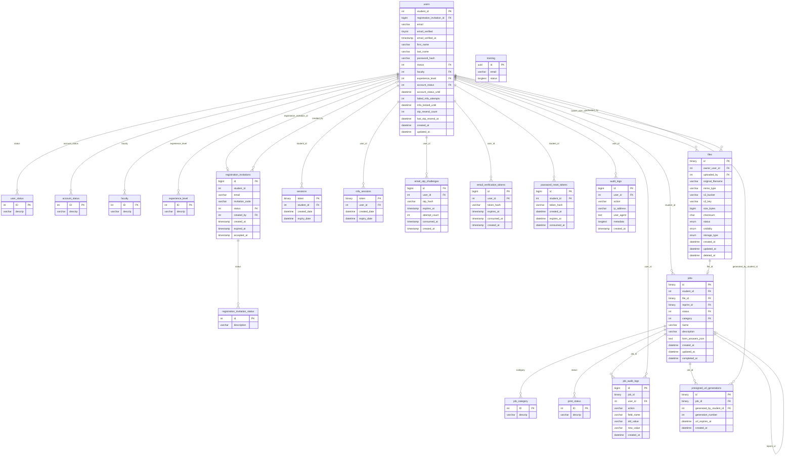

# Database Schema

The 3D Western backend uses a **MariaDB** relational database (`backend_3dw`), managed with **Flyway** for version-controlled schema migrations. The schema is divided into four logical domains: user management, authentication & security, print job lifecycle, and file storage.

---

## Entity Relationship Diagram

---

## Table Descriptions

### Lookup / Reference Tables

#### `user_status`
Defines the membership lifecycle states a user account can be in (e.g. *Pending*, *Active*, *Suspended*). Referenced by `users.status`.

#### `account_status`
Tracks temporary restriction states on a user account, such as lockouts due to repeated failed attempts. Referenced by `users.account_status` alongside `users.account_status_until` for time-bounded restrictions.

#### `faculty`
A static lookup of university faculties (e.g. *Engineering*, *Science*). Users select their faculty during registration and it is stored as a foreign key on `users.faculty`.

#### `experience_level`
A static lookup describing a user's self-reported 3D printing experience (e.g. *Beginner*, *Intermediate*, *Advanced*). Referenced by `users.experience_level`.

#### `print_status`
Defines the possible states of a print job through its lifecycle (e.g. *Pending*, *In Progress*, *Completed*, *Cancelled*). Referenced by `jobs.status`.

#### `job_category`
Classifies print jobs by type (e.g. *FDM*, *Resin*, *Laser Cutting*). Referenced by `jobs.category`.

#### `registration_invitation_status`
Tracks the lifecycle state of an invitation (e.g. *Pending*, *Accepted*, *Expired*). Referenced by `registration_invitations.status`.

---

### Core User Table

#### `users`
The central entity of the system. Each user is identified by their university **student ID** (integer primary key — not auto-generated). This table stores profile information, authentication credentials, and security state all in one place.

Key fields:
- `password_hash` — BCrypt-hashed password.
- `email_verified` / `email_verified_at` — Tracks whether the user has completed email verification.
- `account_status` / `account_status_until` / `account_status_reason` — Supports temporary suspensions with an optional expiry.
- `failed_mfa_attempts` / `mfa_locked_until` — Per-account MFA brute-force protection; the account is locked after 10 consecutive failures.
- `otp_resend_count` / `last_otp_resend_at` — Rate-limits OTP resend requests to 3 per 5-minute window.
- `password_change_attempts` / `last_password_change_attempt_at` — Rate-limits password change requests.
- `registration_invitation_id` — Links back to the invitation used to create the account.

---

### Registration

#### `registration_invitations`
Implements the invite-only signup model. An admin creates an invitation for a specific `student_id` and `email`, generating a unique `invitation_code`. The invitation has an expiry and tracks when it was accepted. Only one active invitation can exist per `(student_id, email)` pair.

#### `registration_invitation_status`
Lookup table for invitation states: pending, accepted, expired, etc.

---

### Authentication & Security Tables

#### `sessions`
Stores active full-authentication sessions. A session token (UUID stored as `binary(16)`) is issued as an HTTP-only cookie after successful MFA verification. Sessions expire after **7 days** (`expiry_date`). On each authenticated request the backend validates the token and expiry against this table.

#### `mfa_sessions`
A short-lived intermediate session created after the user successfully provides their password but *before* they complete MFA. The token is issued as an `mfaToken` cookie and expires after **15 minutes**. Once the OTP is verified, this record is deleted and a full `sessions` record is created.

#### `email_otp_challenges`
Stores the OTP codes sent to a user's email as part of the MFA flow. The actual code is never stored — only its **SHA-256 hash** (`otp_hash`). Each row tracks:
- `attempt_count` — Failed guesses for this specific challenge (locked after a threshold).
- `consumed_at` — Set when the OTP is successfully used; prevents replay.
- `expires_at` — OTPs are short-lived and expire after a fixed window.

#### `email_verification_tokens`
Stores tokens for the new-user email verification step. Similar to OTP challenges, only the SHA-256 hash is stored. The token link expires after **72 hours**. `consumed_at` is set once the link is clicked to prevent reuse.

#### `password_reset_tokens`
Stores tokens for the password reset flow. Only the SHA-256 hash is persisted. A token expires after a short window and is single-use (`consumed_at`).

#### `audit_logs`
An append-only security event log. Every significant auth action (MFA login attempts, OTP successes and failures, session creation, etc.) is recorded here with the user's IP address, user agent, and a JSON `metadata` blob for event-specific context. Indexed on `user_id`, `action`, and `created_at` for efficient querying by security tooling.

---

### File Storage

#### `files`
Tracks all uploaded files. Each file is identified by a UUID (`binary(16)`) and stores metadata such as MIME type, original filename, file size, and a SHA-256 `checksum`. The actual binary content is never stored in the database — instead `s3_bucket` and `s3_key` point to the object in the configured storage backend.

Key fields:
- `status` — `UPLOADING`, `COMPLETED`, or `FAILED`; reflects the upload lifecycle.
- `visibility` — `PUBLIC` or `PRIVATE`; controls access.
- `storage_type` — `SEAWEEDFS` (temporary/local dev) or `S3` (persistent production).
- `owner_user_id` — The user who owns the file.
- `uploaded_by` — The user who performed the upload (may differ from owner in admin scenarios).
- `deleted_at` — Soft-delete; the record is retained for audit purposes.

---

### Print Jobs

#### `jobs`
The primary print job table. Each job is identified by a UUID and belongs to a `student_id`. A job has a single associated `file_id` (enforced unique — one file per job), a `status`, and a `category`. The `form_answers_json` field stores the dynamic submission form data captured at creation time.

Key fields:
- `reprint_id` — Self-referential FK; points to the original job if this job is a reprint of a prior submission.
- `created_at` / `updated_at` / `completed_at` — Full lifecycle timestamps.

#### `job_audit_logs`
A change log for print jobs, recording every admin action taken on a job. Each row captures `field_name`, `old_value`, and `new_value`, making it possible to reconstruct the complete edit history of any job. Indexed on `job_id`, `user_id`, `action`, and `created_at`.

#### `presigned_url_generations`
Tracks every time an admin generates a presigned download URL for a job's file. Each row records who generated it (`generated_by_student_id`), which job it was for, the expiry of the URL, and a monotonically increasing `generation_number` per job. This provides a full audit trail of file access by staff.

---

### Training

#### `training`
Stores training and certification records keyed by `email`. The `status` column is a JSON blob that encodes which training modules have been completed and their outcomes. This table is independent of the `users` table — records may exist for individuals before they have a system account.

---

### Internal

#### `flyway_schema_history`
Managed automatically by **Flyway**. Records every applied database migration script, its checksum, execution time, and success status. This table should not be modified manually.

---

## Schema Notes

- **`job` (legacy)** — A legacy print job table exists alongside `jobs`. It shares similar columns but lacks the `category`, `created_at`/`updated_at` audit columns, and the reprint relationship. New development targets `jobs` exclusively.
- **Token storage** — All security tokens (session tokens, MFA tokens, OTP hashes, verification tokens, reset tokens) are stored as hashes only. Raw token values are never persisted.
- **Soft deletes** — `files` uses a `deleted_at` timestamp for soft deletion rather than hard `DELETE` statements, preserving the audit trail.
- **UUID primary keys** — `files`, `jobs`, `mfa_sessions`, `sessions`, and `presigned_url_generations` use `binary(16)` UUIDs as primary keys for global uniqueness and efficient indexing.
