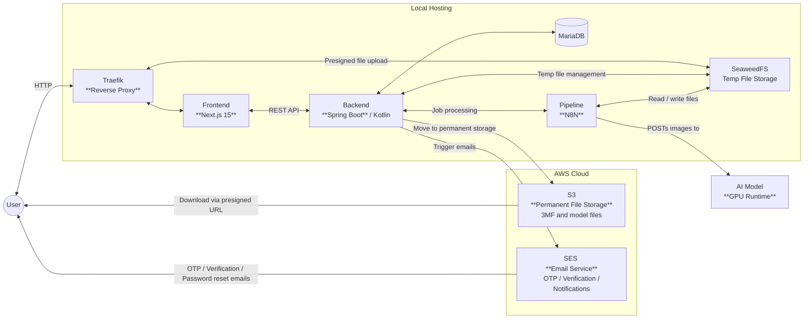
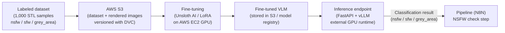

# System Architecture Overview

This document is the entry point for reviewing the 3D Western dashboard. It is currently an invite-only 3D print job management system. The primary sensitive data in scope is **student IDs and associated student email addresses**.

---

## 1. System Architecture Overview

The core dashboard components, such as the client, backend, database and pipeline, are fully self-hosted and containerised on a local machine in the Digital Maker Space within the Western network. Traefik is the sole public ingress. File uploads use a two-stage flow: temporary staging in SeaweedFS, then permanent archival to AWS S3. All logins require mandatory email-based MFA.

**Service roles:**

| Service                      | Role                                                                                  |
| ---------------------------- | ------------------------------------------------------------------------------------- |
| Traefik                      | Sole public ingress; HTTP routing by domain                                           |
| Frontend (Next.js 15)        | Web UI for members and admins; cookie-based session auth                              |
| Backend (Spring Boot/Kotlin) | REST API; enforces auth, authorization, job lifecycle, audit logging                  |
| MariaDB                      | Primary relational store for all application state                                    |
| SeaweedFS                    | Temporary S3-compatible staging for uploaded files before validation                  |
| AWS S3                       | Permanent storage for validated 3D model files, sliced output files and training data |
| AWS SES                      | Transactional email delivery (OTP, verification, notifications)                       |
| N8N                          | Pipeline orchestrator: NSFW check, slicing, printer handoff                           |
| OrcaSlicer                   | 3D model slicing inside the pipeline                                                  |
| PostgreSQL                   | N8N's internal persistence store                                                      |
| Redis                        | N8N job queue (Bull / FIFO)                                                           |

For the full service spec, deployment configuration, and cost breakdown, see [resources.md](https://github.com/3D-Western/3dw-hub/blob/main/docs/report/resources.md).

### Other Self-Hosted Services

In addition to the dashboard, the following utilities are self-hosted for internal club use:

| Service     | Role                                                                                      | Exposure                                      |
| ----------- | ----------------------------------------------------------------------------------------- | --------------------------------------------- |
| Vaultwarden | Self-hosted Bitwarden-compatible password manager for club executives and staff           | Exposed via Traefik; accessible over internet |

Vaultwarden is routed through Traefik and requires internet-accessible exposure so executives and staff can reach it from outside the local Western network. This requires TLS termination at Traefik and an externally reachable domain, which we would like to discuss about, like with the self hosted dashboard.

### Domain & Email Infrastructure

| Provider   | Role                                                                                            |
| ---------- | ----------------------------------------------------------------------------------------------- |
| Hostinger  | Domain name registrar — holds the DNS records for the club's domain                            |
| Namecheap  | Email hosting — provides club email addresses used for outbound SES identity and staff mailboxes |

---

## 2. Service Interactions

### Docker Network Isolation

| Network             | Connected Services                         | Purpose                                                  |
| ------------------- | ------------------------------------------ | -------------------------------------------------------- |
| `traefik-network`   | Traefik, Frontend, SeaweedFS S3            | Public HTTP traffic routing                              |
| `backend-network`   | Frontend, Backend, MariaDB, SeaweedFS S3   | Frontend-to-backend and backend-to-storage communication |
| `pipeline-network`  | N8N (all), OrcaSlicer, PostgreSQL, Redis   | Internal pipeline communication                          |
| `seaweedfs-network` | All SeaweedFS nodes, N8N (all), OrcaSlicer | File access for pipeline and storage internals           |

### Public vs. Internal Reachability

**Publicly reachable (via Traefik on port 80):**
- Frontend web application
- SeaweedFS S3 endpoint for browser-direct presigned file uploads only

**Internal only (unreachable from the internet):**
- **Backend** (port 8000): accessed only by the Frontend container over `backend-network`
- **MariaDB**: accessed only by the Backend
- **Redis**: accessed only within `pipeline-network`
- **N8N**: accessed only within `pipeline-network` and `seaweedfs-network`
- **OrcaSlicer**: accessed only within `pipeline-network`
- **PostgreSQL**: accessed only within `pipeline-network`

> **Note:** The backend is never directly exposed to the internet. All client requests reach the backend only via the authenticated Frontend → Backend path over the internal Docker bridge network.

For the full port and network assignment table, see [system-architecture.md](https://github.com/3D-Western/3dw-hub/blob/main/docs/report/system-architecture.md).

---

## 3. Data Flows

### 3.1 Authentication & MFA

Every login is a mandatory two-phase process. Phase 1 validates credentials and issues a short-lived `mfaToken`. Phase 2 verifies the email OTP and issues a full `sessionToken`. There is no bypass.

**Summary:**
1. User submits student ID + password → backend validates credentials → OTP sent via AWS SES
2. `mfaToken` cookie (15 min, HttpOnly) issued unlocks only MFA endpoints
3. User submits OTP → backend verifies → `sessionToken` cookie (7 days, HttpOnly) issued
4. `mfaToken` is cleared; user redirected to dashboard

For the full sequence diagram, registration flow, and password reset flow, see [authentication.md](https://github.com/3D-Western/3dw-hub/blob/main/docs/report/authentication.md).

---

### 3.2 Job Submission & File Upload

File uploads use a two-stage model: the browser uploads directly to SeaweedFS via a short-lived presigned URL; the backend validates and moves the file to permanent AWS S3 storage before the job enters the pipeline queue.

**Summary:**
1. Member submits job metadata → backend creates job record (status: `PENDING_FILE`) → issues pre-signed PUT URL for SeaweedFS
2. Browser uploads file directly to SeaweedFS via presigned URL (no backend proxy)
3. Member confirms upload → backend retrieves file from SeaweedFS, validates (type, size, checksum), moves to AWS S3
4. Job status updated to `IN_QUEUE`; confirmation email sent via SES
5. Backend hands job off to pipeline; pipeline returns results; member downloads output via presigned S3 GET URL

For the full end-to-end sequence diagram, see [system-architecture.md](https://github.com/3D-Western/3dw-hub/blob/main/docs/report/system-architecture.md).

---

### 3.3 Pipeline Processing

The N8N pipeline receives a job from the backend, vets the file through an NSFW AI check gate, if safe, slices and sends it to the 3D printers via the 3DQue API.

**Summary:**
1. Backend POSTs job ID to N8N webhook; file already staged in SeaweedFS
2. Pipeline pulls the file, extracts rendered images via OpenSCAD
3. Images sent to NSFW AI model (external serving endpoint) for classification
4. **Gate:** If classified as NSFW or grey area → pipeline terminates, result POSTed back to backend; job never reaches the printer
5. If safe → slicer profile applied, model auto-oriented (Tweaker 3), sliced (OrcaSlicer), sent to 3DQue API
6. Pipeline POSTs job completion and output file to backend; N8N logs expire after 1-week TTL

For the detailed pipeline flowchart and workflow steps, see [pipeline-flowchart.md](https://github.com/3D-Western/3dw-hub/blob/main/docs/report/pipeline-flowchart.md).

---

### 3.4 NSFW AI Model Training & Serving

The NSFW classifier is a vision-language model (VLM) fine-tuned on labeled 3D model renders to classify incoming prints and ensure that no inappropriate 3D files are printed in our Maker Space. The classifier categorizes incoming prints into `safe`, `not safe` and `unknown`, the grey area, which requires further review. Training data contains **no student data**, only 3D model renders sourced externally and labeled by annotators.

**Summary:**
- Dataset: 1,000 labeled 3D model renders (400 NSFW, 300 SFW, 300 grey area); stored in AWS S3; versioned with DVC
- Fine-tuning: Unsloth AI (QLoRA) on AWS EC2 GPU instance (one-time / periodic)
- Serving: FastAPI + vLLM on an external serverless GPU runtime (Beam / RunPod)
- The pipeline calls the inference endpoint per job; the endpoint is only required to be live during active pipeline processing

For the full dataset schema, training configuration, and serving setup, see [nsfw-model.md](https://github.com/3D-Western/3dw-hub/blob/main/docs/report/nsfw-model.md).

---

## 4. Data Storage Summary

| Store                        | Type                | Sensitive Data                                                                  | Retention                   |
| ---------------------------- | ------------------- | ------------------------------------------------------------------------------- | --------------------------- |
| MariaDB (self-hosted)        | Relational          | Student IDs, student emails, hashed passwords, first and last names, student faculties, session tokens, OTP challenge hashes, audit logs | Persistent                  |
| SeaweedFS (self-hosted)      | Object, temporary   | Raw 3D model files (pre-validation)                                             | Until validated or rejected |
| AWS S3 application bucket    | Object, permanent   | Validated 3D model files, sliced output files                                   | Job lifecycle               |
| AWS S3 AI dataset bucket     | Object permanent    | 3D model renders for NSFW training (no student data)                            | Dataset lifecycle           |
| N8N PostgreSQL (self-hosted) | Relational          | N8N workflow execution logs                                                     | 1-week TTL for job logs     |
| Redis (self-hosted)          | In-memory queue     | Job queue references only (no file data)                                        | Ephemeral                   |
| AWS SES                      | Transactional email | Student email addresses (delivery only, not stored by SES)                      | Not retained                |

**MariaDB tables in scope (12 total):**

| Table                       | Contains                                                                             |
| --------------------------- | ------------------------------------------------------------------------------------ |
| `users`                     | Student IDs, email addresses, hashed passwords, account status, MFA failure counters |
| `sessions`                  | Active session tokens (UUID, linked to student ID)                                   |
| `mfa_sessions`              | Short-lived MFA tokens (15 min) issued after credential verification                 |
| `email_otp_challenges`      | SHA-256-hashed OTP codes, attempt counters, expiry                                   |
| `invitations`               | Admin-created invite codes (bound to student ID + email)                             |
| `email_verification_tokens` | SHA-256-hashed email verification tokens                                             |
| `password_reset_tokens`     | SHA-256-hashed password reset tokens                                                 |
| `job`                       | Manufacturing job records and status                                                 |
| `files`                     | File metadata and S3 object references                                               |
| `audit_logs`                | Security and MFA event log                                                           |
| `job_audit_logs`            | Job status change history                                                            |
| `presigned_url_generations` | Upload retry tracking                                                                |

> **Note:** No financial data and no payment information is collected or stored anywhere in this system.

---

## 5. Security Practices

### Security Mechanisms Summary

The following table is drawn from [authentication.md](https://github.com/3D-Western/3dw-hub/blob/main/docs/report/authentication.md):

| Mechanism                                        | Implementation                                                                                       |
| ------------------------------------------------ | ---------------------------------------------------------------------------------------------------- |
| **Password hashing**                             | BCrypt (Spring Security default cost factor)                                                         |
| **OTP hashing**                                  | SHA-256 stored as Base64 (not BCrypt to avoid timing side-channels)                                  |
| **Token hashing** (password reset, email verify) | SHA-256 stored as Base64                                                                             |
| **Constant-time comparison**                     | `MessageDigest.isEqual()` for OTP and email verification token checks                                |
| **User enumeration prevention**                  | Login returns identical error for unknown user and wrong password; password reset always returns 200 |
| **OTP brute-force protection**                   | Max 5 attempts per challenge; 10 account-level failures → 15-minute lockout                          |
| **OTP resend rate limiting**                     | Max 3 resends per 5-minute window                                                                    |
| **Email verify resend rate limiting**            | Max 3 resends per 5-minute window                                                                    |
| **Session fixation**                             | MFA session is deleted and a new session is created on OTP success                                   |
| **Cookie security**                              | `HttpOnly; Secure; Path=/`; no JS access, HTTPS-only in production                                  |
| **CORS**                                         | Restricted to configured frontend origin only                                                        |
| **Invite-only registration**                     | No public self-registration path                                                                     |
| **Password reset invalidates sessions**          | All active sessions deleted on successful password reset                                             |
| **Audit logging**                                | MFA attempts, OTP events, email verification events persisted in `audit_logs`                        |

---

### Authentication & Identity

- **Invite-only registration:** Admin issues an invite bound to a specific student ID and email. The user's provided student ID and email must exactly match the invitation at signup.
- **Email verification required** before first login (`emailVerified = false` until consumed)
- **BCrypt password hashing**: a minimum of 10 characters is enforced at registration and password reset
- **Mandatory email OTP on every login**. There is no bypass nor opt-out for this.
- OTP: SHA-256 hashed, 6-digit, 10-minute expiry, 5-attempt limit per challenge
- Account MFA lockout: 10 total failed attempts → 15-minute lock (`mfaLockedUntil`)

### Session & Token Security

- **Two-token model:** `mfaToken` (15 min, `HttpOnly` cookie) grants access to MFA endpoints only; `sessionToken` (7 days, `HttpOnly` cookie) grants full API access
- **Tokens never exposed to JavaScript**, `HttpOnly` prevents any client-side access
- Sessions are invalidated on password reset (all active sessions for the user are deleted)
- All S3 and SeaweedFS access uses **short-lived presigned URLs** , and no storage credentials are ever returned to the client. SeaweedFS does not interact with the client frontend at all.

### Authorization

- **Role-based access control:**

| Role          | Access                                                |
| ------------- | ----------------------------------------------------- |
| `Member`      | Own profile, own jobs, own file downloads only        |
| `Admin`       | All users, all jobs, all files, invitation management. Only club executives can obtain this status. |
| `MFA_PENDING` | MFA endpoints only (no full API access)               |
| `Blacklisted` | All API access denied                                 |
|               |                                                       |

- Admin-only routes (`/api/v1/admin/**`) are enforced server-side via Spring Security `@PreAuthorize` annotations
- Backend is not exposed externally; all client requests transit through the authenticated Frontend → Backend path

### Network Isolation

- Four Docker networks with distinct scopes (see Section 2)
- Backend, MariaDB, Redis, N8N, pipeline services are unreachable from the internet
- Traefik is the sole ingress point for all external traffic

### Rate Limiting & Abuse Prevention

- Password changes: 5 per hour
- OTP resend: max 3 per 5-minute window
- Email verification resend: max 3 per 5-minute window
- Upload presigned URL retries: max 10 attempts, 60-second cooldown
- User enumeration prevention: identical error response for unknown user vs. wrong password

### Audit Logging

- **`audit_logs` table:** MFA login attempts, OTP verifications, email verification events, and security events
- **`job_audit_logs` table:** All job status changes with timestamps

### Data in Transit

- The system currently operates over **HTTP only**, running on the local Western network (not exposed to the internet).
- **Known gap / open security item for IT audit:** External internet access requires **TLS termination at Traefik**. This is a known prerequisite before any public deployment and is pending discussion with Western IT. Cookie flags include `Secure` (HTTPS-only enforcement) which will activate once TLS is in place. No external deployment should proceed until this is resolved.

### File Safety

- File type, size, and checksum validation is performed by the backend before any file is moved to permanent AWS S3 storage
- **NSFW AI scan gates the pipeline**, and files classified as NSFW or grey area cause the job to terminate; the file never reaches the printer
- Presigned URLs are scoped to a specific S3 object with a short expiry, so no broad storage access is granted to any client

---

## 6. Related Documents

| Document | Purpose | Link |
|---|---|---|
| system-architecture.md | Full component specs, deployment config, Docker network table, detailed data flow sequence diagrams | [system-architecture.md](https://github.com/3D-Western/3dw-hub/blob/main/docs/report/system-architecture.md) |
| authentication.md | Complete auth/MFA/session implementation, token details, API endpoint reference | [authentication.md](https://github.com/3D-Western/3dw-hub/blob/main/docs/report/authentication.md) |
| pipeline-flowchart.md | Detailed pipeline workflow, N8N orchestration, NSFW gate, printer handoff | [pipeline-flowchart.md](https://github.com/3D-Western/3dw-hub/blob/main/docs/report/pipeline-flowchart.md) |
| nsfw-model.md | NSFW AI model training dataset, fine-tuning process, serving infrastructure | [nsfw-model.md](https://github.com/3D-Western/3dw-hub/blob/main/docs/report/nsfw-model.md) |
| resources.md | Full infrastructure service list, cost breakdown, hardware requirements | [resources.md](https://github.com/3D-Western/3dw-hub/blob/main/docs/report/resources.md) |
