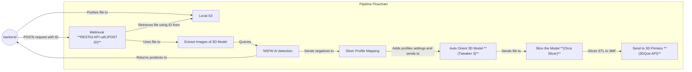

# Pipeline Flowchart 

The pipeline receives print jobs from the backend and is responsible for automated preprocessing of 3D prints, vetting and safety checks (whether the print is 
appropriate) before being actually sent to the printers. Processing scripts include auto orient, image extraction for NSFW AI vision model checks and slicing.

The current pipeline uses a self hosted docker container of an n8n instance to execute a linear workflow for the vetting process for ensure the STL files are safe and printable,
before actually sending them to the 3DQue printers via the 3DQue API, which is also locally hosted.

# Workflow 

1. Backend POSTs request via an API gateway to the n8n instance 
2. Backend sends to file to the local SeeweedFS S3 compatible bucket 
3. The pipeline webhook receives the backend POST request, which sends the metadata of the print job including the filename (the key) for retrieving the raw file from the bucket
4. If the pipeline is saturated or busy, n8n handles queuing of jobs internally using Redis, and processes job in a First In First Out (FIFO) manner 
5. n8n pulls the raw file from the bucket for the corresponding print job it starts on 
6. Images are extracted from the raw 3D file via a Python script using OpenSCAD
7. The images are sent to a Vision language Model as a microservice; if the vision language model (VLM) returns a positive classification, the pipeline terminates and POSTs the result of the printjob including the metadata to the backend, otherwise the pipeline continues after receiving a response from the VLM
8. Based on the metadata of the print request, slicer profile settings are applied 
9. The 3D model is auto oriented for the best position for slicing using the Tweaker 3 CLI 
10. The 3D model is sliced, and then sent to 3DQue's queuing system for printing 

# Future modifications 

Future iterations of the pipeline will move from the n8n proof of concept to a code first approach, but the architecture will remain the same.

## Future Integrations and Improvements to the Pipeline 

A future agentic-first approach for interacting and modifying the pipeline is currently in the works. The architecture will remain the same with similar localhosting, 
with remote API calls to offload AI compute to LLM providers or a remote GPU runtime for any fine tuned open source models. The pipeline will instead be exposed via a self-hosted
Model Context Protocol (MCP) server for AI agents or clients to interact with.
