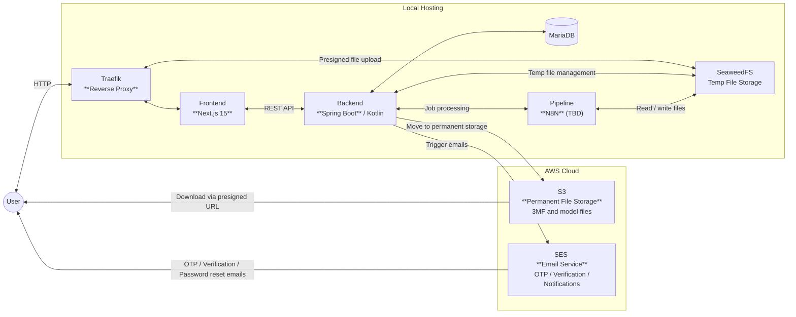
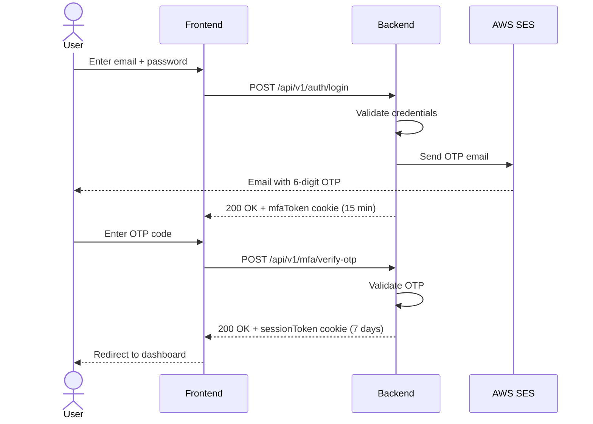
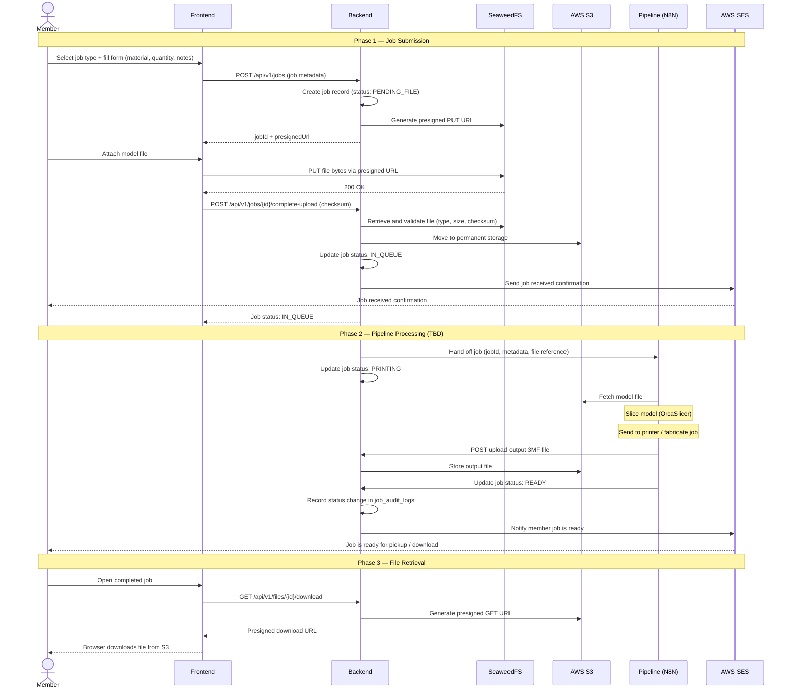

# System Architecture

## Overview

The 3D Western dashboard is a web-based management system for 3DWestern, a manufacturing club offering 3D printing, CNC milling, laser cutting, and waterjet cutting services. Members submit jobs, track status, and download processed output files. Administrators manage the user roster, job queue, and club invitations through a dedicated admin panel.

The system is fully self-hosted and containerised. Traefik acts as the public-facing reverse proxy. File uploads use a two-stage flow — temporary staging in SeaweedFS, then permanent archival to AWS S3. All logins require mandatory email-based multi-factor authentication (MFA).

---

## Architecture Diagram

---

## Tech Stack

| Layer            | Technology   | Version | Purpose                                      |
| ---------------- | ------------ | ------- | -------------------------------------------- |
| Reverse Proxy    | Traefik      | 3.0     | HTTP routing, domain-based dispatch          |
| Frontend         | Next.js      | 15      | Web UI (App Router, React Server Components) |
| Frontend         | React        | 19      | UI library                                   |
| Frontend         | TypeScript   | 5.x     | Type safety                                  |
| Frontend         | Tailwind CSS | 4.x     | Utility-first styling                        |
| Backend          | Spring Boot  | 4.0     | REST API framework                           |
| Backend          | Kotlin       | 2.2     | Primary language                             |
| Backend          | Java         | 17      | JVM runtime                                  |
| Database         | MariaDB      | 11.2    | Primary relational database                  |
| Local Storage    | SeaweedFS    | latest  | S3-compatible temp file staging              |
| File Storage     | AWS S3       | —       | Permanent 3D model storage                   |
| Email            | AWS SES      | —       | Transactional email delivery                 |
| Pipeline  | N8N          | 2.3.1   | Workflow automation engine                   |
| Pipeline | PostgreSQL   | 16.1    | N8N persistence store                        |
| Pipeline  | Redis        | 7       | N8N job queue (Bull)                         |
| Pipeline  | OrcaSlicer   CLI | 2.3.1   | 3D model slicing                             |

---

## Components

### Traefik

Reverse proxy that handles all inbound HTTP traffic on port 80. Routes requests to services based on domain rules configured via Docker labels. Exposes two public domains: the frontend web app and the SeaweedFS S3 endpoint (for presigned file uploads from the browser). The backend is not exposed through Traefik — it is accessed only by the frontend container over the internal Docker bridge network.

### Frontend

- **Framework:** Next.js 15 (React 19, TypeScript, App Router)
- **Auth:** Cookie-based sessions (`sessionToken`) with mandatory MFA via email OTP
- **Roles:** Member, Admin
- **Key features:** Job submission (3D Print / CNC / Laser Cutting / Waterjet), job tracking, admin panel (user & job management, invitations), resumable file uploads via presigned URLs
- **Runs on:** Port 3000 (internal); publicly accessible via Traefik

### Backend

- **Framework:** Spring Boot 4.0 (Kotlin, Java 17)
- **Auth:** Session tokens + MFA session tokens; BCrypt password hashing; invite-only registration
- **Key features:** User & session management, job lifecycle, presigned URL generation, file validation and transfer, audit logging, rate limiting
- **API:** RESTful, versioned under `/api/v1`; OpenAPI/Swagger UI at `/swagger-ui`
- **Runs on:** Port 8000 (internal only, not exposed through Traefik)

### MariaDB

Primary relational database for all application state. Managed with Flyway schema migrations (21 migrations). Key tables:

| Table                       | Purpose                                          |
| --------------------------- | ------------------------------------------------ |
| `users`                     | User accounts (student ID, email, roles, status) |
| `sessions`                  | Active session tokens                            |
| `mfa_sessions`              | Short-lived MFA tokens (15 min)                  |
| `email_otp_challenges`      | OTP codes for MFA                                |
| `job`                       | Manufacturing job records and status             |
| `files`                     | File metadata and S3 references                  |
| `invitations`               | Invite codes for registration                    |
| `email_verification_tokens` | Account verification links                       |
| `password_reset_tokens`     | Password reset links                             |
| `audit_logs`                | Security and MFA event log                       |
| `job_audit_logs`            | Job status change history                        |
| `presigned_url_generations` | Upload retry tracking                            |

### SeaweedFS

Distributed S3-compatible object store running as four containers (master, volume, filer, s3). Serves as a temporary staging area for file uploads. When a job is submitted, the user's browser uploads the file directly to SeaweedFS via a short-lived presigned URL. The backend later retrieves the file, validates it, and moves it to AWS S3. SeaweedFS is accessible to both the backend (over the internal `seaweedfs-network`) and the browser (via Traefik on `${SEAWEEDFS_S3_DOMAIN}`).

### AWS S3

Permanent object storage for validated 3D model and output files. Files are moved here by the backend after a successful upload confirmation. Users download finished files directly from S3 via presigned URLs generated by the backend.

### AWS SES

Transactional email service. Used to send OTP codes, email verification links, password reset links, and job status notifications. Supports a test mode that logs emails instead of sending them.

### Pipeline _(TBD)_

Job processing pipeline for submitted manufacturing jobs. Based on **N8N** (workflow automation) running in a three-container queue mode (main UI, webhook, worker), with **OrcaSlicer** for 3D model slicing. N8N uses PostgreSQL for persistence and Redis (Bull) for its job queue. All pipeline containers share the `seaweedfs-network` to access files directly. Integration with the backend and detailed workflow design are to be defined.

---

## Key Data Flows

### Authentication & MFA

Every login requires a two-step verification. On first factor, the backend issues a short-lived `mfaToken`. On successful OTP verification, a full `sessionToken` is issued.

For full details on registration, email verification, MFA security mechanisms, password reset, session management, roles, and the complete API reference, see **[Authentication & Authorization](authentication.md)**.

### Job Creation (End-to-End)

The full job lifecycle spans three phases: submission by the member, automated processing by the pipeline, and file retrieval by the member. File uploads use a two-stage flow — the browser uploads directly to SeaweedFS via a presigned URL; the backend validates and moves the file to permanent S3 storage, then hands the job off to the pipeline. The pipeline handles all processing and reports results back to the backend when finished.

---

## Deployment

### Services

All services run as Docker containers orchestrated with Docker Compose.

| Service          | Image                   | External Port               | Internal Network(s)                                 |
| ---------------- | ----------------------- | --------------------------- | --------------------------------------------------- |
| Traefik          | `traefik:v3.0`          | 80 (HTTP), 8081 (dashboard) | traefik-network                                     |
| Frontend         | custom (Node 24 Alpine) | via Traefik                 | traefik-network, backend-network                    |
| Backend          | custom (JVM 17)         | —                           | backend-network                                     |
| MariaDB          | `mariadb:11.2`          | —                           | backend-network                                     |
| SeaweedFS Master | `seaweedfs:latest`      | 9333                        | seaweedfs-network                                   |
| SeaweedFS Volume | `seaweedfs:latest`      | 8082                        | seaweedfs-network                                   |
| SeaweedFS Filer  | `seaweedfs:latest`      | 8888                        | seaweedfs-network                                   |
| SeaweedFS S3     | `seaweedfs:4.07`        | via Traefik / 8333          | seaweedfs-network, traefik-network, backend-network |
| N8N Main         | custom                  | 5678                        | pipeline-network, seaweedfs-network                 |
| N8N Webhook      | custom                  | —                           | pipeline-network, seaweedfs-network                 |
| N8N Worker       | custom                  | —                           | pipeline-network, seaweedfs-network                 |
| OrcaSlicer       | custom                  | —                           | pipeline-network, seaweedfs-network                 |
| PostgreSQL       | `postgres:16.1`         | —                           | pipeline-network                                    |
| Redis            | `redis:7-alpine`        | —                           | pipeline-network                                    |

### Docker Networks

| Network             | Connected Services                         | Purpose                                                  |
| ------------------- | ------------------------------------------ | -------------------------------------------------------- |
| `traefik-network`   | Traefik, Frontend, SeaweedFS S3            | Public HTTP traffic routing                              |
| `backend-network`   | Frontend, Backend, MariaDB, SeaweedFS S3   | Frontend-to-backend and backend-to-storage communication |
| `pipeline-network`  | N8N (all), OrcaSlicer, PostgreSQL, Redis   | Internal pipeline communication                          |
| `seaweedfs-network` | All SeaweedFS nodes, N8N (all), OrcaSlicer | File access for pipeline and storage internals           |

---

## Security Model

### Registration

Registration is invite-only. An admin creates an invitation linked to a specific student ID. The user signs up using the invite code and their student ID must match before an account is created. Email verification is required before first login.

### Authentication

- **Credentials:** Email + password (BCrypt hashed, minimum 10 characters)
- **MFA:** Mandatory email OTP on every login; no bypass available
- **Session tokens:** HttpOnly, Secure cookies; `sessionToken` valid for 7 days (renewable via `/auth/refresh`); `mfaToken` valid for 15 minutes
- **Password reset:** Time-limited single-use token (30 min expiry) delivered via SES

### Authorization

| Role          | Access                                                |
| ------------- | ----------------------------------------------------- |
| `Member`      | Own profile, own jobs, own file downloads             |
| `Admin`       | All users, all jobs, all files, invitation management |
| `MFA_PENDING` | MFA endpoints only (no full API access)               |
| `Blacklisted` | Access denied                                         |

Admin-only routes are enforced server-side via Spring Security `@PreAuthorize` annotations on `/api/v1/admin/**` and the user list endpoint.

### Additional Protections

- **Rate limiting:** Password changes (5 attempts/hour); OTP resend (cooldown enforced); upload retries (max 10 attempts, 60s cooldown)
- **CORS:** Restricted to the configured frontend origin only
- **Audit logging:** MFA login attempts, OTP verifications, and security events are persisted in `audit_logs` and `job_audit_logs` for traceability
- **Presigned URLs:** All direct S3/SeaweedFS access uses short-lived signed URLs — no storage credentials are ever exposed to the client
